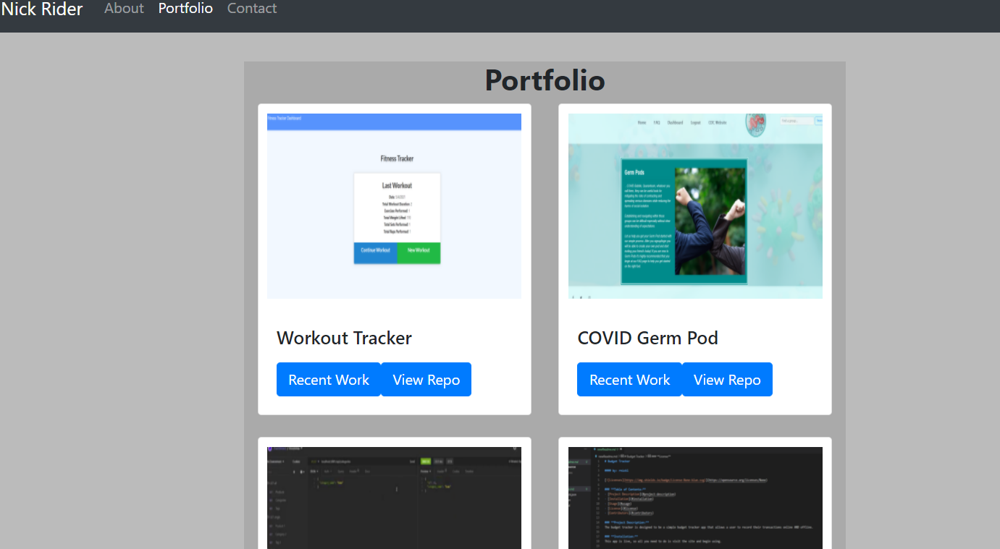

# Welcome to my web portfolio!

This project is essentially a newer version of a portfolio that I created earlier in my career as a web developer. In my [previous version](https://rnick1.github.io/Responsive_Portfolio/index.html) I built my web portfolio using basic HTML, JavaScript, and CSS skills. In this newer version I used the React JavaScript library. Changes from the previous version include a portfolio page that is dedicated to just tech-related projects, a link to a better version of my resume, and style changes throughout the whole application. At the time of writing (5/12/21) I plan to refine my code further so that my components are broken down into even smaller components (mostly for practice on my part) and replacing the plain grey background with a suitable image. I am also open to suggestions so if you see ways to improve feel free to click the contact me link on my contact page or email me at rnick0260@gmail.com.

### Here is a link to the site:

<a href="https://nickriderportfolio.herokuapp.com/">Nick_Rider_Portfolio<a>

### Thank you for visiting my repository!

